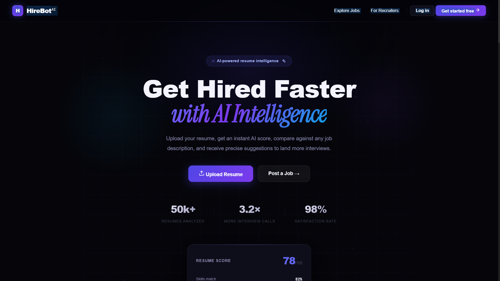

# 🤖 HireBot — AI-Powered Resume Screening System

<div align="center">


[](https://nodejs.org)
[](https://reactjs.org)
[](https://mongodb.com)
[](https://ai.google.dev)
[](https://expressjs.com)

**Get Hired Faster with AI Intelligence**

_Upload your resume → Get AI Score → Fix gaps → Apply smarter_

[🚀 Features](#-features) • [🛠️ Tech Stack](#️-tech-stack) • [📦 Installation](#-installation) • [🔌 API Docs](#-api-documentation) • [🗺️ Project Flow](#️-project-flow)

</div>

---

## 📸 Screenshots

<div align="center">
 
### 🏠 Landing Page


</div>

## 📌 What is HireBot?

HireBot is a full-stack AI-powered resume screening system that helps:

- **Job Seekers** — analyze their resume, find skill gaps, get AI suggestions, and apply smarter
- **Recruiters** — automatically rank candidates using AI, shortlist the best fits, and post better job descriptions

---

## ✨ Features

### 👤 For Job Seekers

| Feature                    | Description                                     |
| -------------------------- | ----------------------------------------------- |
| 📊 **Resume Score**        | AI gives your resume a score out of 100         |
| 🎯 **JD Matching**         | Compare your resume against any job description |
| 🔍 **Skill Gap Detection** | See exactly which skills you're missing         |
| 💡 **AI Suggestions**      | Get specific, actionable improvement tips       |
| ✏️ **Bullet Rewriter**     | AI rewrites weak bullet points with metrics     |
| 📄 **ATS Optimizer**       | Check if your resume passes ATS systems         |
| 📥 **PDF Generator**       | Download an AI-optimized resume as PDF          |
| 🎤 **Interview Prep**      | Get personalized interview questions            |
| 📋 **Application Tracker** | Track all your applications and statuses        |

### 🏢 For Recruiters

| Feature                     | Description                                         |
| --------------------------- | --------------------------------------------------- |
| 📝 **Post Jobs**            | Create and manage job listings                      |
| 🤖 **AI Job Enhancer**      | AI improves your job description                    |
| 🏆 **Candidate Ranking**    | Applicants auto-ranked by AI match score            |
| 📊 **Dashboard Stats**      | Total applicants, shortlisted, active jobs          |
| ✅ **Shortlist / Reject**   | Manage candidates with one click                    |
| 💬 **AI Candidate Summary** | Strengths, weaknesses, missing skills per candidate |

---

## 🛠️ Tech Stack

### Frontend

```
React.js 18          → UI Framework
React Router v7      → Client-side routing
Framer Motion        → Animations
Axios                → API calls
SCSS                 → Styling
Vite                 → Build tool
```

### Backend

```
Node.js              → Runtime
Express.js           → REST API framework
MongoDB + Mongoose   → Database & ODM
JWT                  → Authentication
bcryptjs             → Password hashing
Multer               → PDF file upload
pdf-parse            → Extract text from PDF
Puppeteer            → Generate PDF from HTML
```

### AI Layer

```
Google Gemini 2.0 Flash   → AI model
@google/genai             → Google AI SDK
Zod                       → Schema validation
zod-to-json-schema        → Structured AI responses
```

---

## 📁 Project Structure

```
HireBot/
├── 📂 Frontend/
│   └── src/
│       ├── features/
│       │   ├── landing/          → Landing page
│       │   ├── auth/             → Login, Register, Protected
│       │   │   ├── pages/        → Login.jsx, Register.jsx
│       │   │   ├── hooks/        → useAuth.js
│       │   │   ├── services/     → auth.api.js
│       │   │   ├── components/   → Protected.jsx
│       │   │   └── auth.context.js
│       │   ├── resume/           → Resume Analyzer
│       │   ├── jobs/             → Job listings & details
│       │   ├── jobseeker/        → Dashboard, Tracker
│       │   └── recruiter/        → Dashboard, Post Job, Applicants
│       ├── styles/               → Global SCSS styles
│       ├── app.routes.jsx        → All routes
│       └── main.jsx              → Entry point
│
└── 📂 Backend/
    └── src/
        ├── config/
        │   └── database.js       → MongoDB connection
        ├── controllers/
        │   ├── auth.controller.js
        │   ├── resume.controller.js
        │   ├── job.controller.js
        │   ├── application.controller.js
        │   └── interview.controller.js
        ├── middlewares/
        │   ├── auth.middleware.js → JWT verification
        │   ├── role.middleware.js → Role-based access
        │   └── file.middleware.js → Multer file upload
        ├── models/
        │   ├── user.model.js
        │   ├── resume.model.js
        │   ├── job.model.js
        │   ├── application.model.js
        │   ├── interviewReport.model.js
        │   └── blacklist.model.js
        ├── routes/
        │   ├── auth.routes.js
        │   ├── resume.routes.js
        │   ├── job.routes.js
        │   ├── application.routes.js
        │   └── interview.routes.js
        ├── services/
        │   └── ai.service.js     → Google Gemini AI
        └── app.js
```

---

## 📦 Installation

### Prerequisites

- Node.js 18+
- MongoDB Atlas account (free)
- Google AI Studio account (for Gemini API key)

---

### 1️⃣ Clone the repository

```bash
git clone https://github.com/YOUR_USERNAME/hirebot.git
cd hirebot
```

---

### 2️⃣ Backend Setup

```bash
cd Backend
npm install
```

Create `.env` file in the `Backend` folder:

```env
PORT=3000
NODE_ENV=development

# MongoDB
MONGO_URI=your_mongodb_connection_string

# JWT
JWT_SECRET=your_secret_key_here

# Google Gemini AI
GOOGLE_GENAI_API_KEY=your_gemini_api_key

# Frontend URL
CLIENT_URL=http://localhost:5173
```

Start the backend:

```bash
node server.js
```

You should see:

```
MongoDB Connected
Server is running on port 3000
```

---

### 3️⃣ Frontend Setup

```bash
cd Frontend
npm install
npm run dev
```

Open → **http://localhost:5173**

---

## 🔑 Getting API Keys

### MongoDB URI

1. Go to [mongodb.com/atlas](https://mongodb.com/atlas)
2. Create free cluster
3. Click **Connect** → **Drivers**
4. Copy the connection string
5. Replace `<password>` with your DB password

### Google Gemini API Key

1. Go to [aistudio.google.com](https://aistudio.google.com)
2. Click **Get API Key**
3. Create new API key
4. Copy and paste in `.env`

> ⚠️ **Note:** Free tier has daily quota limits. If you hit the limit, wait 24 hours or upgrade to pay-as-you-go (~$0.075 per 1M tokens).

---

## 🔌 API Documentation

### 🔐 Auth Routes

| Method | Route                       | Access  | Description                        |
| ------ | --------------------------- | ------- | ---------------------------------- |
| POST   | `/api/auth/register`        | Public  | Register as jobseeker or recruiter |
| POST   | `/api/auth/login`           | Public  | Login with email & password        |
| GET    | `/api/auth/logout`          | Public  | Logout & clear cookie              |
| GET    | `/api/auth/me`              | Private | Get current user                   |
| PUT    | `/api/auth/profile`         | Private | Update profile                     |
| PUT    | `/api/auth/change-password` | Private | Change password                    |

### 📄 Resume Routes (Job Seeker only)

| Method | Route                          | Access  | Description                   |
| ------ | ------------------------------ | ------- | ----------------------------- |
| POST   | `/api/resume/analyze`          | Private | Upload PDF + JD → AI analysis |
| GET    | `/api/resume`                  | Private | Get all my resume analyses    |
| GET    | `/api/resume/:id`              | Private | Get single analysis           |
| DELETE | `/api/resume/:id`              | Private | Delete analysis               |
| POST   | `/api/resume/rewrite-bullet`   | Private | AI rewrite a bullet point     |
| POST   | `/api/resume/generate-pdf/:id` | Private | Download optimized PDF        |

### 💼 Job Routes

| Method | Route                         | Access    | Description                  |
| ------ | ----------------------------- | --------- | ---------------------------- |
| GET    | `/api/jobs`                   | Public    | Browse all jobs with filters |
| GET    | `/api/jobs/:id`               | Public    | Get single job details       |
| GET    | `/api/jobs/recommended`       | Jobseeker | AI job recommendations       |
| POST   | `/api/jobs`                   | Recruiter | Post a new job               |
| POST   | `/api/jobs/enhance`           | Recruiter | AI enhance job description   |
| PUT    | `/api/jobs/:id`               | Recruiter | Update job                   |
| DELETE | `/api/jobs/:id`               | Recruiter | Delete job                   |
| GET    | `/api/jobs/recruiter/my-jobs` | Recruiter | Get my posted jobs           |

### 📋 Application Routes

| Method | Route                               | Access    | Description                    |
| ------ | ----------------------------------- | --------- | ------------------------------ |
| POST   | `/api/applications/apply/:jobId`    | Jobseeker | Apply to a job                 |
| GET    | `/api/applications/my`              | Jobseeker | Get my applications            |
| GET    | `/api/applications/my/:id`          | Jobseeker | Single application details     |
| GET    | `/api/applications/job/:jobId`      | Recruiter | Get all applicants (AI ranked) |
| PUT    | `/api/applications/:id/status`      | Recruiter | Shortlist / Reject / Hire      |
| GET    | `/api/applications/recruiter/stats` | Recruiter | Dashboard stats                |

---

## 🗺️ Project Flow

```
User visits HireBot
        ↓
  Landing Page → Register / Login
        ↓
    ┌───┴───┐
    ▼       ▼
JobSeeker  Recruiter
    ↓           ↓
Upload      Post Job
Resume      (AI Enhanced)
    ↓           ↓
AI Analysis  Candidates
(Score,      Auto-Ranked
Gaps, Tips)  by AI
    ↓           ↓
Apply to    Shortlist
Jobs        Best Fits
    ↓           ↓
Track       Hire Top
Status      Candidate
```

---

## ⚠️ Known Issues

| Issue                            | Status   | Notes                                                          |
| -------------------------------- | -------- | -------------------------------------------------------------- |
| Gemini API quota limit           | ⚠️ Known | Free tier has daily limits. Upgrade to paid for production use |
| Puppeteer on some systems        | ⚠️ Known | May need `--no-sandbox` flag on Linux servers                  |
| PDF parsing for image-based PDFs | ⚠️ Known | Only works with text-based PDFs, not scanned images            |

---

## 🚧 Work In Progress

- [ ] Job Seeker Dashboard page
- [ ] Job Listings page with filters
- [ ] Job Details page with AI insights
- [ ] Application Tracker page
- [ ] Recruiter Post Job page
- [ ] Recruiter Applicants page
- [ ] Google OAuth login
- [ ] Email notifications
- [ ] Resume builder from scratch

---

## 👨‍💻 Author

**Your Name**

- GitHub: [@YOUR_USERNAME](https://github.com/YOUR_USERNAME)
- LinkedIn: [Your LinkedIn](https://linkedin.com/in/yourprofile)

---

## 📄 License

This project is licensed under the MIT License.

---

<div align="center">

**Built with ❤️ using React, Node.js, MongoDB and Google Gemini AI**

⭐ Star this repo if you found it helpful!

</div>
